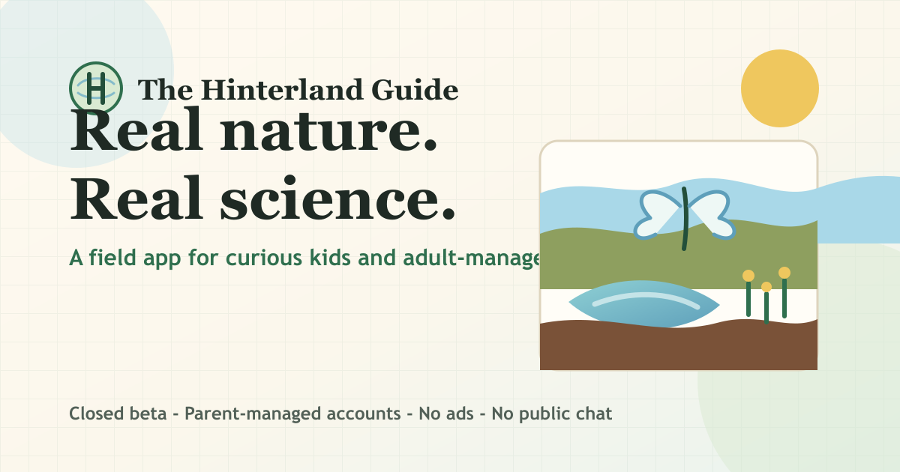

# Hinterland

[](https://github.com/bzinkan/Hinterland/actions/workflows/ci.yml)

Hinterland (formerly Dragonfly; full title "The Hinterland Guide") is a
citizen-science field app for curious explorers of all ages. People log real
outdoor observations, fill a personal Dex, complete expeditions, and may
eventually contribute approved observations to iNaturalist through a reviewed
contribution flow. Kid accounts remain adult-managed.

**Live landing page:** [thehinterlandguide.app](https://thehinterlandguide.app)

<table>
  <tr>
    <td align="center">
      <a href="https://thehinterlandguide.app">
        
      </a>
    </td>
    <td align="center">
      
    </td>
  </tr>
</table>

## Repo Layout

```text
backend/      FastAPI app, Alembic migrations, admin jobs, async-worker code.
mobile/       Expo app for Android, iOS, and parents web.
web/          Public landing page static site (thehinterlandguide.app).
content/      Expedition and Sanctuary JSON. Source of truth for authored content.
scripts/      Smoke tests, content validation/sync, schema generation, helper tools.
infra-azure/  Azure setup/decommission scripts and manifest.
infra-gcp/    Legacy GCP Terraform kept for historical reference only.
infra/        Legacy AWS CDK reference path.
docs/         Architecture, data model, ADRs, risks, runbooks, pilot checklists.
internal/     Internal-only tooling. Never import into kid-facing backend code.
AGENTS.md     Guardrails and current risk closure plan for coding agents.
```

## Current Direction

The active runtime target is **Azure**, per
[`docs/adr/0010-azure-target-architecture.md`](docs/adr/0010-azure-target-architecture.md)
and [`docs/adr/0014-firebase-gcp-decommission.md`](docs/adr/0014-firebase-gcp-decommission.md).
ADR 0010 supersedes the earlier GCP target ADRs 0005, 0008, and 0009; ADR
0014 removes the old Firebase/GCP rollback path.

Active Azure shape:

- API: Azure Container Apps running `backend/Dockerfile`.
- Database: Azure Database for PostgreSQL Flexible Server.
- Photos: Azure Blob Storage with SAS URLs.
- Adult auth: Microsoft Entra External Identities.
- Kid auth: Hinterland-signed RS256 handoff/session JWTs.
- Moderation provider: Azure AI Content Safety, still async and off the hot path.
- Frontend: parents web, apex, and www on Azure Static Web Apps.

Residual GCP/Firebase resources are historical until externally deleted. Do not
add new Cloud Run, Cloud SQL, Cloud Tasks, Eventarc, Cloud Vision, Cloud DNS,
Firebase Hosting, or Firebase Auth implementation unless a new ADR explicitly
reopens the platform decision.

## Getting Started

Prereqs: Python 3.12, `uv`, Docker, Node 20, and npm.

```bash
make install
make dev-db
make db-migrate
make dev
curl localhost:8080/health
curl localhost:8080/ready
curl localhost:8080/v1/meta
```

Docker smoke:

```bash
docker build -f backend/Dockerfile -t hinterland-api .
docker run --rm -p 8080:8080 -e DRAGONFLY_ENV=local hinterland-api
curl localhost:8080/health
```

Mobile checks:

```bash
cd mobile
npm ci
npm run typecheck
APP_ENV=play-internal npm run config:play-internal
```

Azure smoke:

```bash
curl -fsS https://api.thehinterlandguide.app/health
curl -fsS https://api.thehinterlandguide.app/ready
curl -fsS https://api.thehinterlandguide.app/.well-known/dragonfly-kid-jwks.json

# Authenticated parent/kid smoke requires an operator-provided Entra token.
DRAGONFLY_SMOKE_ENTRA_BEARER="<access-token>" \
  python scripts/smoke_azure_parent_kid.py
```

## Where To Look

- **Agent instructions and guardrails:** `AGENTS.md`
- **Architecture:** `docs/architecture.md`
- **Postgres model:** `docs/data-model.md`
- **Dispatcher/rewards:** `docs/dispatcher.md`
- **Mobile constraints:** `docs/mobile.md`
- **Sanctuary:** `docs/sanctuary.md`
- **Runbook:** `docs/runbook.md`
- **Risks:** `docs/risks/`
- **Decisions:** `docs/adr/`

## Current Phase

Code is in closed-beta polish. The immediate priority is the W1 Android
Internal Testing pilot: Entra parent setup via web, native kid QR handoff,
coarse-location manifest, Azure deployment hygiene, and docs/risk closure.
